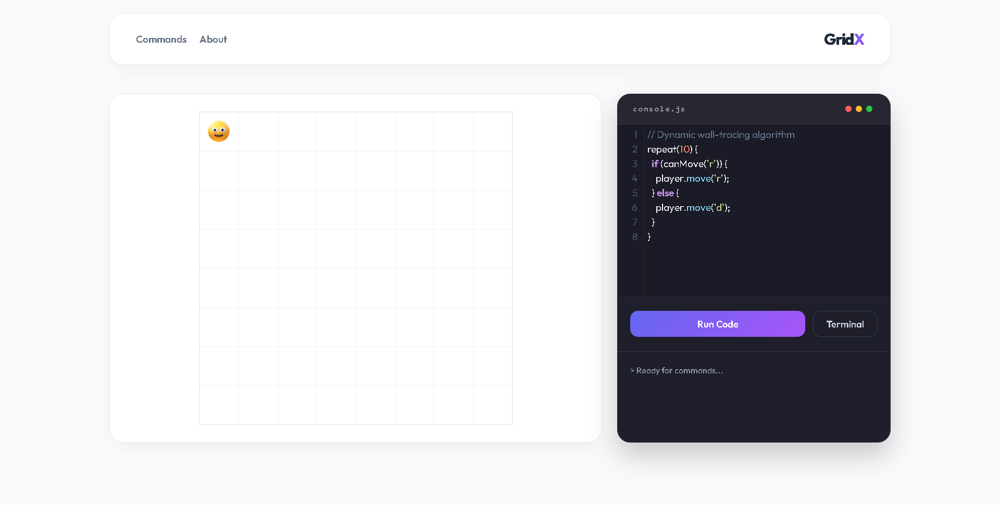
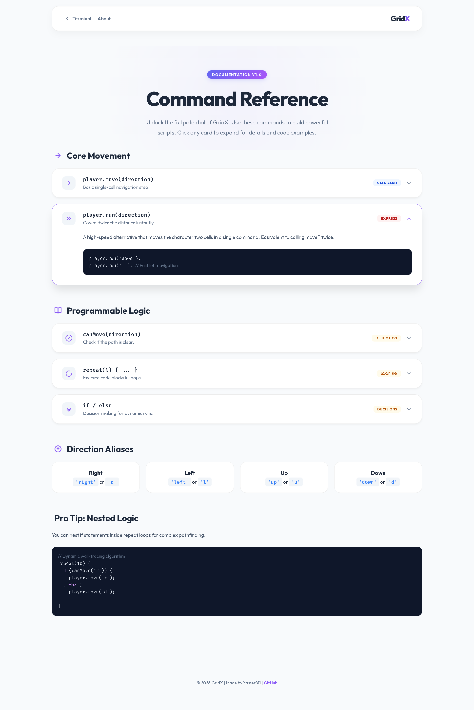

# GridX - Code Your Way 🕹️

GridX is an interactive, educational coding game designed to teach the fundamentals of logic and JavaScript through movement. Control your character in a grid-based environment using real-time code execution.

---

## 🚀 Live Demo
**[GridX Live](https://gridx811.vercel.app)**

---

## 🖼️ Preview

### Main Interface


### Commands Page


---

## ✨ Key Features

- **Real-Time Execution:** Write JavaScript and see the results instantly on the grid.
- **Premium Documentation:** A full, interactive command reference integrated into the app.
- **Advanced Logic Support:** Use `repeat()` loops, `if/else` conditions, and `canMove()` detection.
- **Modern UI/UX:** A sleek, minimalist dashboard with glassmorphism effects and smooth animations.
- **Responsive Design:** Fully optimized for both desktop and mobile developers.
- **Integrated Terminal:** Real-time logging of your script's progress and errors.

## 🛠️ Technology Stack

- **Frontend:** Vanilla JavaScript (ES6+), HTML5, CSS3
- **Code Editor:** CodeMirror 5
- **Typography:** Outfit & Fira Code
- **Icons:** SVG-based custom illustrations

## 🕹️ Quick Start: Basic Commands

```javascript
player.move('right');
player.run('down');

repeat(5) {
  player.move('r');
  if (canMove('d')) {
    player.move('d');
  }
}